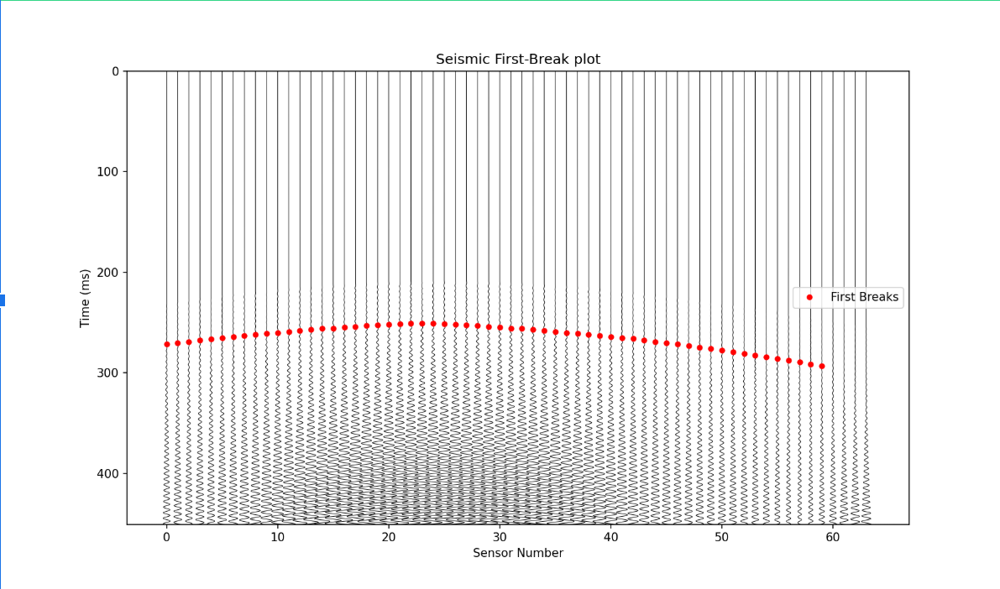
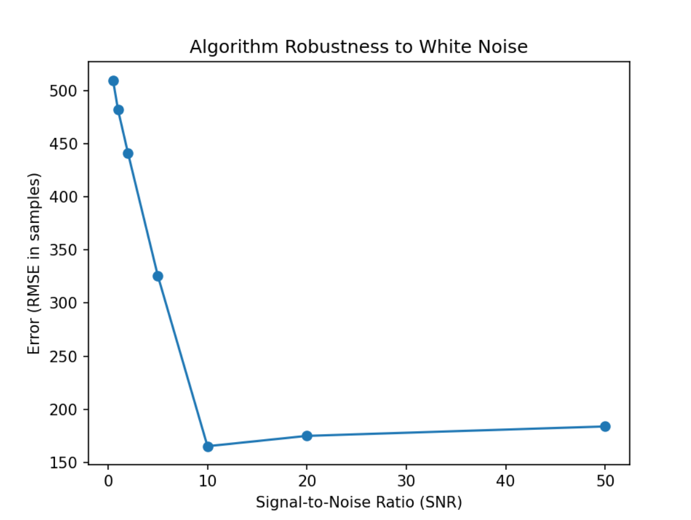
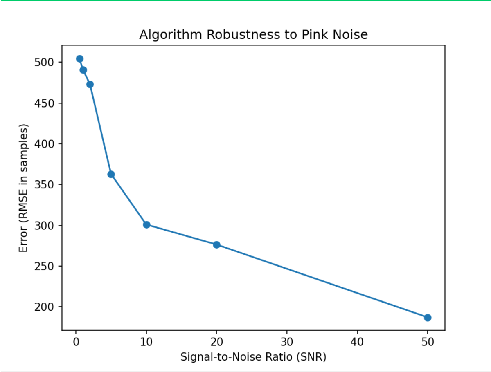

# picking-homework

STA/LTA first-break picking for seismic data. Detects P-wave arrivals by comparing short-term and long-term signal averages — when the ratio spikes, that's your pick.

## Two strategies

1. **Absolute threshold** — scan each trace, flag the first sample above a fixed amplitude. Simple, works near the source, falls apart at distance.

2. **Model-driven STA/LTA** — run a coarse STA/LTA pass to get approximate picks, fit a traveltime model to the confident ones, then re-pick in a narrow window around the model prediction. Gets the distant traces right.

## Results

Tested against white and pink noise at varying SNR levels.

### No noise
\
short_window=120, long_window=400, ratio_threshold=3.2

### White noise
\
short_window=100, long_window=600, ratio_threshold=1.6

### Pink noise
\
short_window=80, long_window=600, ratio_threshold=1.6

## Running

```bash
pip install -e .
python src/main.py
```
